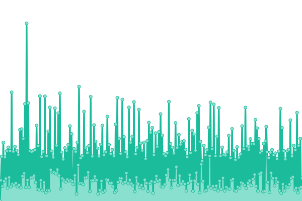
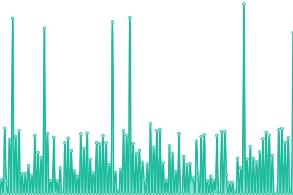

# [📈 Live Status](https://demo.upptime.js.org): <!--live status--> **🟧 Partial outage**

This repository contains the open-source uptime monitor and status page for [Upptime](https://upptime.js.org), powered by [Upptime](https://github.com/upptime/upptime).

With [Upptime](https://upptime.js.org), you can get your own unlimited and free uptime monitor and status page, powered entirely by a GitHub repository. We use [Issues](https://github.com/upptime/upptime/issues) as incident reports, [Actions](https://github.com/vcsphere/upptime/actions) as uptime monitors, and [Pages](https://demo.upptime.js.org) for the status page.

<!--start: status pages-->
<!-- This summary is generated by Upptime (https://github.com/upptime/upptime) -->
<!-- Do not edit this manually, your changes will be overwritten -->
<!-- prettier-ignore -->
| URL | Status | History | Response Time | Uptime |
| --- | ------ | ------- | ------------- | ------ |
|  [Spryr B2B](https://spryr.com) | 🟥 Down | [spryr-b2-b.yml](https://github.com/spryr/upptime/commits/HEAD/history/spryr-b2-b.yml) | 

 347ms
     
 | 

<a href="https://status.spryr.com/history/spryr-b2-b">37.04%</a>
    

|  [Spryr Booking](https://booking.spryr.com) | 🟥 Down | [spryr-booking.yml](https://github.com/spryr/upptime/commits/HEAD/history/spryr-booking.yml) | 

 3786ms
     
 | 

<a href="https://status.spryr.com/history/spryr-booking">35.80%</a>
    

|  [CPanel](https://cpanel.sharelifegateway.com/) | 🟩 Up | [c-panel.yml](https://github.com/spryr/upptime/commits/HEAD/history/c-panel.yml) | 

 414ms
     
 | 

<a href="https://status.spryr.com/history/c-panel">100.00%</a>
    

|  [VCSphere.vip](https://vcsphere.vip/) | 🟩 Up | [vc-sphere-vip.yml](https://github.com/spryr/upptime/commits/HEAD/history/vc-sphere-vip.yml) | 

 768ms
     
 | 

<a href="https://status.spryr.com/history/vc-sphere-vip">100.00%</a>
    

|  [LXTR](https://lxtr.net/) | 🟩 Up | [lxtr.yml](https://github.com/spryr/upptime/commits/HEAD/history/lxtr.yml) | 

 672ms
     
 | 

<a href="https://status.spryr.com/history/lxtr">100.00%</a>
    

|  [Voyanto.net](https://voyanto.net/) | 🟩 Up | [voyanto-net.yml](https://github.com/spryr/upptime/commits/HEAD/history/voyanto-net.yml) | 

 534ms
     
 | 

<a href="https://status.spryr.com/history/voyanto-net">100.00%</a>
    

|  [VCSphere Insights](https://vcsphereinsights.com) | 🟩 Up | [vc-sphere-insights.yml](https://github.com/spryr/upptime/commits/HEAD/history/vc-sphere-insights.yml) | 

 466ms
     
 | 

<a href="https://status.spryr.com/history/vc-sphere-insights">100.00%</a>
    

|  [Voyanto Insights](https://voyantoinsights.com) | 🟩 Up | [voyanto-insights.yml](https://github.com/spryr/upptime/commits/HEAD/history/voyanto-insights.yml) | 

 543ms
     
 | 

<a href="https://status.spryr.com/history/voyanto-insights">100.00%</a>
    

|  [LXTR Insights](https://lxtrinsights.com) | 🟩 Up | [lxtr-insights.yml](https://github.com/spryr/upptime/commits/HEAD/history/lxtr-insights.yml) | 

 533ms
     
 | 

<a href="https://status.spryr.com/history/lxtr-insights">100.00%</a>
    

<!--end: status pages-->

[**Visit our status website →**](https://demo.upptime.js.org)

## 📄 License

- Powered by: [Upptime](https://github.com/upptime/upptime)
- Code: [MIT](./LICENSE) © [Anand Chowdhary](https://anandchowdhary.com), supported by [Pabio](https://pabio.com)
- Data in the `./history` directory: [Open Database License](https://opendatacommons.org/licenses/odbl/1-0/)
